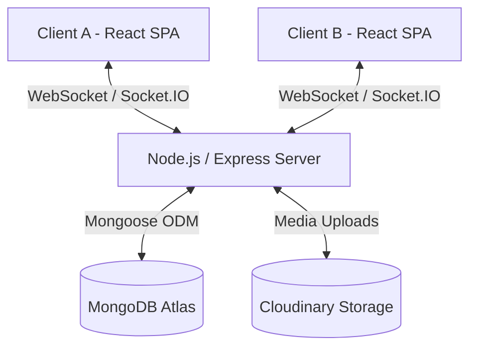

# QuickChat System Architecture

Designed and implemented by **Gulshan Kumar (IIIT Ranchi)**.

```mermaid
graph TD
  UserA[Client A - React SPA] <-->|WebSocket / Socket.IO| SocketServer[Node.js / Express Server]
  UserB[Client B - React SPA] <-->|WebSocket / Socket.IO| SocketServer
  SocketServer <-->|Mongoose ODM| Mongo[(MongoDB Atlas)]
  SocketServer <-->|Media Uploads| Cloudinary[(Cloudinary Storage)]
```
